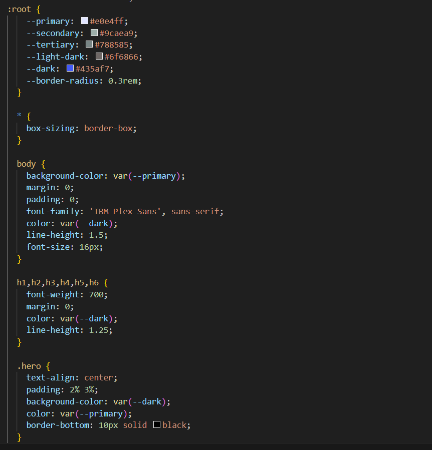

# Weather-Dashboard

## Description

- What was your motivation? I learn alot about Web-server-APIs for javascript and how used the local storage so make my website more professional and was very challenge
- Why did you build this project? I build this project to show the weather for city and show it 5days-forecast 
1- I solved many problems like: add textbox to git the cityname and show it in the webpage
2- when result show the cityname save on localstorage and show it in search history
3- show the weather current and fucture
4- webpage show cityname, date,temperature,humidity and wind speed and show it in 5days-forcast
5- when click to search history will show the weather for thats city
- What did you learn? I learn web-server-APIs for javascript and how to used the data in side the api , read and used them.

## Installation

N/A

## Usage
when open the webpage, in left side there is a textbox for cityname , when push button to search for cityname, the page will show the weather data for 5-days forecast in right side for page.

https://omeraus6.github.io/Weather-Dashboard/
deploy link

https://github.com/omeraus6/Weather-Dashboard
github link

image 1: 

image 2: 

image 3:  

image 4: 

image 5: 

image 6: from image 1 to 6 show html and css code

image 7: show webpage run

image 8: 

image 9: image 8 and 9 show js code

## Credits

Thank you for tips and sugestion from Bootcamp instructors and classmates, I hava used the class meterial to have some codes and design ,https://www.w3schools.com/ and https://developer.mozilla.org/en-US/docs/Web/CSS/grid-template to reserch information 

## License

Please refer to the LICENSE in the repo.